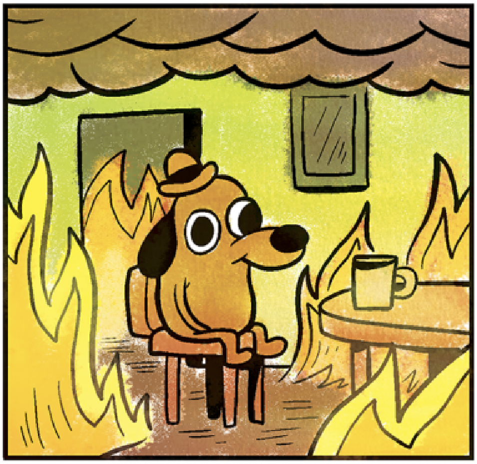

# 🔥 this-is-fine: AI-Powered Wildfire Risk Monitoring

> Real-time wildfire detection and risk assessment using NASA satellite data, NOAA weather integration and live particulate data from the EPA and PurpleAir network.

---

_This was mostly a "vibe-coding" excercise to try out Claude Code integration with Zed, and it worked remarkably well. The local LLM, qwen2.5:145b works okay--expect confusion if it tries to invoke too many tools in mcp_server at once._

---


[](https://www.python.org/downloads/)
[](https://github.com/astral-sh/uv)
[](LICENSE)


## 🎯 Overview

**this-is-fine** is a comprehensive wildfire monitoring system that combines multiple real-time data sources to assess and visualize fire risk across the continental United States. The system features an innovative natural language interface powered by local LLMs, allowing users to query fire data conversationally without writing code.

### Key Features

- 🛰️ **Real-time Fire Detection** - NASA FIRMS satellite data (VIIRS/MODIS) with ~3 hour latency
- 🌤️ **Weather Integration** - NOAA National Weather Service API for enhanced risk scoring
- 💨 **Air Quality Monitoring** - EPA AirNow and PurpleAir sensor networks for smoke/PM2.5 tracking
- 🤖 **Natural Language Interface** - Chat with your fire data using local LLMs (Qwen2.5, Llama3.2)
- 🏭 **Industrial Filtering** - ML-based temporal persistence analysis to filter out refineries, steel plants, etc.
- 🗺️ **Interactive Visualizations** - Plotly maps, Kepler.gl integration, and real-time dashboards
- ⚡ **Fast & Local** - DuckDB spatial database, no cloud dependencies, runs entirely on your machine

## 🚀 Quick Start

### Prerequisites

- macOS, Linux, or Windows (WSL2)
- Python 3.12+ (managed by `uv`)
- 16GB+ RAM (24GB recommended for LLM features)
- NASA FIRMS API key ([get one free](https://firms.modaps.eosdis.nasa.gov/api/))

### Installation

```bash
# Clone the repository
git clone https://github.com/yourusername/this-is-fine.git
cd this-is-fine

# Install uv (if not already installed)
curl -LsSf https://astral.sh/uv/install.sh | sh

# Sync dependencies
uv sync

# Set up environment variables
cp .env.example .env
# Edit .env and add your FIRMS_API_KEY
```

### First Run - Fetch Fire Data

```bash
# Fetch fires for California from the last 2 days
uv run python -c "from flows.etl_flow import wildfire_etl_flow; wildfire_etl_flow()"
```

This will:
1. Fetch active fire detections from NASA FIRMS
2. Filter out industrial heat sources
3. Calculate risk scores with weather data
4. Create 5km buffer zones
5. Export to `data/processed/active_fires.geojson`

### Launch the Web Interface

```bash
# Install Ollama (for local LLM)
brew install ollama  # macOS
# or visit https://ollama.ai for other platforms

# Pull a language model
ollama pull qwen2.5:14b

# Start the web interface
uv run python web/gradio_app.py
```

Open http://localhost:7860 and try:
- "Fetch fires in Oregon and add weather data"
- "Show me air quality information for the fires"
- "Create a risk heatmap"

## 📊 Architecture

### System Overview

```
┌────────────────────────────────────────────────────────────┐
│                    User Interfaces                         │
├─────────────────┬───────────────────┬──────────────────────┤
│  Gradio Web UI  │  MCP Server API   │  Plotly Notebooks    │
│  (LLM Chat)     │  (Tool Protocol)  │  (Visualization)     │
└────────┬────────┴─────────┬─────────┴───────────┬──────────┘
         │                  │                     │
         ▼                  ▼                     ▼
┌────────────────────────────────────────────────────────────┐
│                   Prefect ETL Pipeline                     │
├──────────────┬──────────────┬──────────────┬───────────────┤
│ Fetch Fires  │   Enrich     │  Calculate   │   Generate    │
│ (NASA FIRMS) │ (NOAA/AQI)   │  Risk Scores │   Buffers     │
└──────┬───────┴──────┬───────┴──────┬───────┴───────┬───────┘
       │              │              │               │
       ▼              ▼              ▼               ▼
┌────────────────────────────────────────────────────────────┐
│                     Data Layer                             │
├─────────────────┬────────────────────┬─────────────────────┤
│  DuckDB         │  GeoJSON Files     │  Plotly HTML Maps   │
│  (Spatial DB)   │  (Kepler.gl)       │  (Dashboards)       │
└─────────────────┴────────────────────┴─────────────────────┘
```

### Technology Stack

**Data Ingestion:**
- NASA FIRMS API - Active fire detections from VIIRS/MODIS satellites
- NOAA NWS API - Real-time weather, fire danger indices
- EPA AirNow API - Air Quality Index (AQI) data
- PurpleAir API - Community PM2.5 sensor network

**Processing & Storage:**
- Prefect - ETL orchestration with caching (3-hour expiration)
- DuckDB - Spatial database with PostGIS-like capabilities
- GeoPandas/Shapely - Geospatial data manipulation
- NumPy/Pandas - Risk calculation and analysis

**LLM & Interface:**
- Gradio - Web UI framework
- Ollama - Local LLM runtime (Qwen2.5:14b, Llama3.2)
- MCP (Model Context Protocol) - Standardized tool interface

**Visualization:**
- Plotly - Interactive web maps with MapLibre
- Kepler.gl - Advanced geospatial visualization
- Jupyter - Exploratory data analysis

## 🧠 Risk Calculation Model

The system uses a weighted risk scoring model that adapts based on available data:

### Base Model (Satellite Data Only)
- **30%** Brightness Temperature (fire intensity)
- **20%** Detection Confidence
- **30%** Fire Radiative Power (FRP)
- **20%** Day/Night Flag

### Enhanced Model (With Weather Data)
- **20%** Brightness Temperature
- **15%** Detection Confidence
- **20%** Fire Radiative Power
- **10%** Day/Night Flag
- **15%** Relative Humidity (inverted: low = high risk)
- **10%** Wind Speed (high wind = high risk)
- **5%** Precipitation Probability (inverted)
- **5%** NOAA Fire Danger Index

**Risk Categories:**
- 🟡 **Low** (0-30): Minimal threat, monitor
- 🟠 **Moderate** (30-60): Elevated risk, prepare
- 🔴 **High** (60-100): Critical risk, evacuate

## 🏭 Industrial Heat Source Filtering

One of the unique features is intelligent filtering of false positives from industrial sources using temporal persistence analysis:

```python
# Identifies facilities with 2+ detections over 30 days
# Examples: steel plants, refineries, gas flares, cement kilns

┌───────────────────────────────────────────────────────────┐
│  Before Filtering: 1,423 fires detected                   │
│  After Filtering:  1,267 fires (156 industrial filtered)  │
│  Accuracy: ~11% false positive reduction                  │
└───────────────────────────────────────────────────────────┘
```

The system maintains a database of ~69 known persistent industrial heat sources across the US, validated using satellite imagery.

## 🗺️ Visualization Examples

### Plotly Interactive Maps

```bash
# Open the Plotly visualization notebook
uv run jupyter notebook notebooks/plotly_visualization.ipynb
```

**Available visualizations:**
- Basic fire points (colored by risk)
- Risk heatmap (density-weighted)
- AQI heatmap (air quality overlay)
- PurpleAir PM2.5 heatmap (smoke density)
- Fire buffer zones (risk containment areas)

### Kepler.gl Professional Maps

```bash
# Export data for Kepler.gl
# Data is automatically exported to data/processed/

# 1. Go to https://kepler.gl/demo
# 2. Upload active_fires.geojson and fire_buffers.geojson
# 3. Configure layers using docs/kepler_visualization_guide.md
```

## 🤖 Natural Language Interface

The system includes a Gradio-based web interface with local LLM integration:

**Example Conversations:**

```
User: "Fetch fires in California and add weather data"
Assistant: [Executes fetch_fires tool]
          "Found 150 fires in California (23 industrial sources filtered).
           I'll now enrich them with weather data..."
          [Executes enrich_weather tool]
          "Added weather data to 142/150 fires. Most areas show low
           humidity (18-25%) and high winds (30-40 km/h), significantly
           increasing fire risk."

User: "Show me which fires have dangerous air quality"
Assistant: [Executes enrich_aqi tool]
          "Enriched 47/150 fires with AQI data. 12 fires have AQI > 150
           (Unhealthy), primarily in the Central Valley region."
```

**Supported Commands:**
- Data fetching by region or bounding box
- Weather enrichment (NOAA)
- Air quality enrichment (AirNow, PurpleAir)
- Visualization generation
- Statistical summaries

## 📁 Project Structure

```
this-is-fine/
├── src/
│   ├── ingestion/         # API clients (FIRMS, NOAA, AirNow, PurpleAir)
│   ├── analysis/          # Risk calculation, spatial operations
│   ├── database/          # DuckDB initialization and queries
│   ├── filters/           # Industrial heat source filtering
│   └── commands/          # CLI and MCP command implementations
├── flows/
│   └── etl_flow.py        # Prefect orchestration pipeline
├── mcp_server/
│   ├── server.py          # MCP protocol implementation
│   └── tools.py           # Tool definitions (6 tools)
├── web/
│   └── gradio_app.py      # LLM-powered web interface
├── notebooks/
│   └── plotly_visualization.ipynb  # Interactive analysis
├── data/
│   ├── static/            # Persistent industrial heat sources
│   ├── processed/         # GeoJSON outputs, visualizations
│   └── wildfire.duckdb    # Spatial database
└── docs/                  # Comprehensive documentation
```

## 📖 Documentation

Comprehensive documentation available in `docs/`:

**Getting Started:**
- **[Quick Start Guide](docs/quick_start_web_interface.md)** - 5-minute setup for web interface
- **[Gradio Web Interface Guide](docs/gradio_web_interface.md)** - Full LLM interface documentation

**Technical Reference:**
- **[GIS Spatial Operations](docs/gis_spatial_operations.md)** - GeoPandas/Shapely → ArcGIS mapping for GIS professionals
- **[Industrial Filtering](docs/industrial_filtering.md)** - How false positives are removed
- **[NOAA Integration](docs/noaa_integration.md)** - Weather enrichment details
- **[MCP Tool Logging](docs/mcp_tool_logging.md)** - Understanding tool execution logs

**Data & Visualization:**
- **[Kepler.gl Guide](docs/kepler_visualization_guide.md)** - Professional geospatial visualization
- **[Bounding Boxes Reference](docs/bounding_boxes.md)** - US state/region coordinates
- **[Data Directory Structure](docs/data_directory_structure.md)** - File organization
- **[FIRMS Overview](docs/firms_overview.md)** - Understanding satellite fire detection

## 🎓 Use Cases

**Emergency Management:**
- Real-time fire tracking with 3-hour latency
- Risk-based prioritization for resource allocation
- Air quality monitoring for evacuation planning

**Research & Analysis:**
- Historical fire pattern analysis
- Weather correlation studies
- Industrial heat source mapping

**Public Information:**
- Community fire awareness
- Smoke exposure tracking
- Evacuation zone visualization

## 🔧 Advanced Usage

### Custom Bounding Box

```python
from flows.etl_flow import wildfire_etl_flow

# Fetch fires for a custom region
wildfire_etl_flow(
    bbox=(-124.5, 32.5, -114.0, 42.0),  # California
    days_back=2,
    buffer_km=10,  # 10km risk zones
    use_weather=True,
    use_aqi=True,
    filter_industrial=True
)
```

### MCP Server Integration

```bash
# Start the MCP server for external integrations
uv run python mcp_server/server.py
```

The MCP server provides 6 tools:
- `fetch_fires` - Get fire data by region/bbox
- `enrich_weather` - Add NOAA weather data
- `enrich_aqi` - Add EPA air quality data
- `enrich_purpleair` - Add PurpleAir sensor data
- `visualize_fires` - Generate interactive maps
- `get_fire_stats` - Summary statistics

### Jupyter Notebook Analysis

```bash
# Launch Jupyter for exploratory analysis
uv run jupyter notebook notebooks/plotly_visualization.ipynb
```

## 🚧 Roadmap

**Current Features (v1.0):**
- ✅ NASA FIRMS integration
- ✅ NOAA weather enrichment
- ✅ Industrial filtering
- ✅ Local LLM interface
- ✅ Plotly/Kepler.gl visualizations

**Future Enhancements (v2.0?):**
- [ ] Retro-cool interface using Typer and MapSCII?
- [ ] 7-day fire spread prediction (weather forecasts)
- [ ] Mobile-responsive dashboard
- [ ] Email/SMS alerting for specified region
- [ ] Vegetation/fuel moisture modeling

## 🤝 Contributing

Contributions are welcome! Areas of interest:

- Additional data sources (weather models, vegetation indices)
- Improved risk calculation models
- Alternative LLM integrations
- Performance optimizations for large datasets
- Documentation improvements

## 📜 License

This project is licensed under the MIT License - see the [LICENSE](LICENSE) file for details.

## 🙏 Acknowledgments

**Data Sources:**
- [NASA FIRMS](https://firms.modaps.eosdis.nasa.gov/) - Fire detection data
- [NOAA National Weather Service](https://www.weather.gov/) - Weather and fire indices
- [EPA AirNow](https://www.airnow.gov/) - Air quality data
- [PurpleAir](https://www2.purpleair.com/) - Community air quality sensors

**Technologies:**
- [Prefect](https://www.prefect.io/) - Workflow orchestration
- [DuckDB](https://duckdb.org/) - Embedded database
- [Gradio](https://gradio.app/) - Web interface framework
- [Ollama](https://ollama.ai/) - Local LLM runtime
- [Kepler.gl](https://kepler.gl/) - Geospatial visualization

## 📧 Contact

**Project Maintainer:** [Bryan Hughes]
- GitHub: [@rbhughes](https://github.com/rbhughes)
- Email: bryan@purr.io

---

**Built with ❤️ for our inflamed world**

